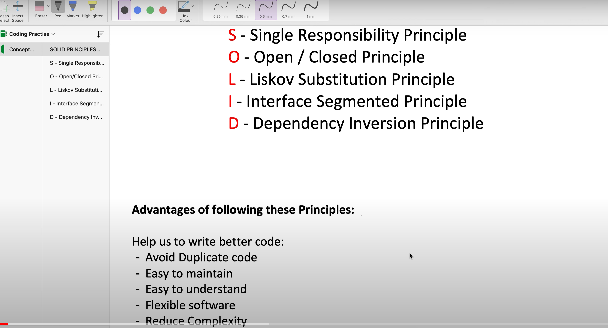

# SOLID Principles - Design Patterns
- Single Responsibility Principle
- Open-Closed Principle
- Liskov Substitution Principle
- Interface Segregation Principle
- Dependency Inversion Principle

https://www.freecodecamp.org/news/solid-principles-explained-in-plain-english/
 
Credit: [Concept && Coding YT channel]
https://youtu.be/XI7zep97c-Y 

