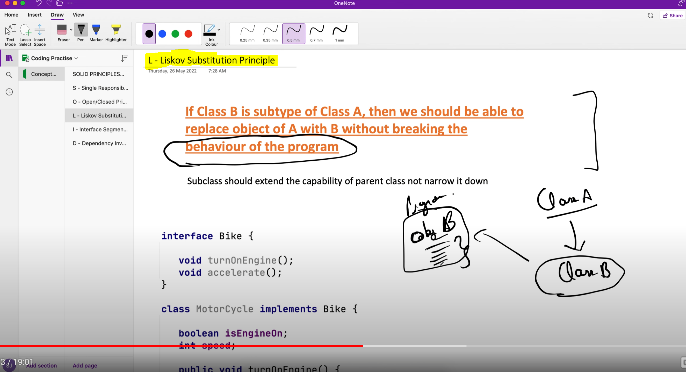

# L - Liskov Substitution Principle
## We should be able to replace Parent class object with Child class object without breaking the behaviour of the program
## => Sub class should extend of parent class, not narrow it down

