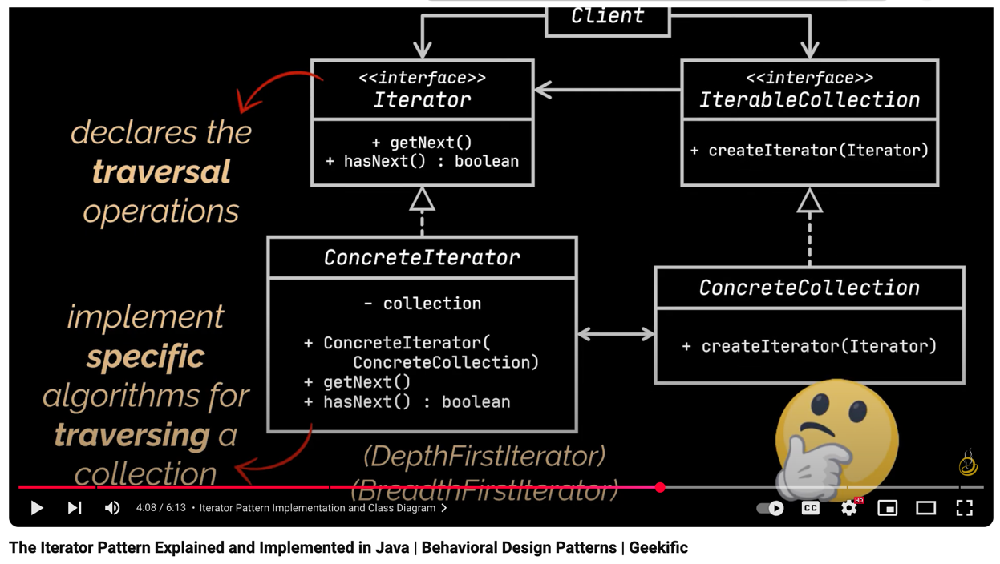

## Iterator Pattern - Problem Statement
### Suppose you have a collection and you want to provide a mechanism to access it's elements!
### So, without Iterator Pattern, the client code need to understand how the collection is structured, and different collection would require different methods to traverse them... 
### Iterator pattern provides a way to access elements of a collection sequentially without exposing its underlying representation

