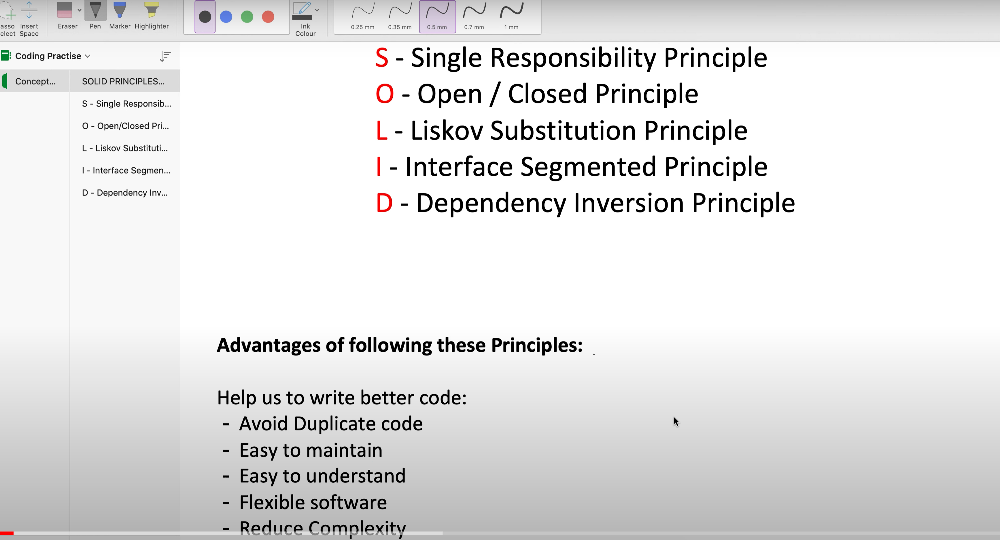

# SOLID Principles - Design Patterns
1. [Single Responsibility Principle](https://github.com/shubhajitml/design-patterns-monk/tree/master/SOLID/src/main/java/SingleResponsibility)
2. [Open-Closed Principle](https://github.com/shubhajitml/design-patterns-monk/tree/master/SOLID/src/main/java/OpenClosed)
3. [Liskov Substitution Principle](https://github.com/shubhajitml/design-patterns-monk/tree/master/SOLID/src/main/java/LiskovSubstitutionPrinciple)
4. [Interface Segregation Principle](https://github.com/shubhajitml/design-patterns-monk/tree/master/SOLID/src/main/java/InterfaceSegregationPrinciple)
5. [Dependency Inversion Principle](https://github.com/shubhajitml/design-patterns-monk/tree/master/SOLID/src/main/java/DependencyInversionPrinciple)

https://www.freecodecamp.org/news/solid-principles-explained-in-plain-english/
 
Credit: Concept && Coding YT channel - 
- https://youtu.be/XI7zep97c-Y 

