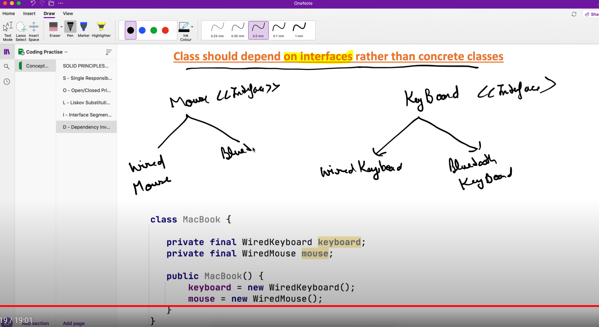
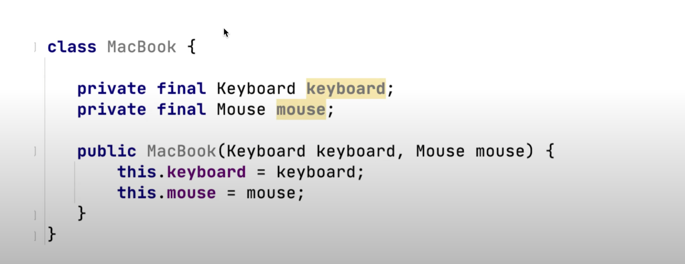

# Dependency Inversion Principle
## Classes should depend upon interfaces or abstract classes instead of concrete classes

Violating the Dependency Inversion Principle :

Following the Dependency Inversion Principle :
